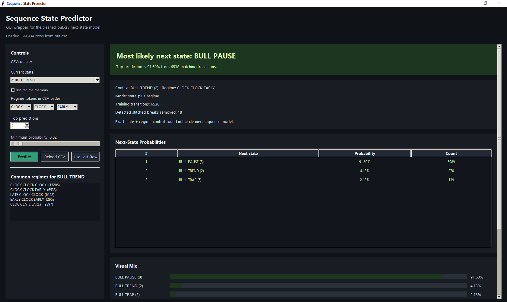

# 🧠 Sequence State Predictor (Tkinter GUI)

An interactive desktop application for predicting the next state in a financial sequence model using a cleaned transition dataset (`out.csv`).

Built with Tkinter, this tool provides a visual interface for exploring probabilistic state transitions and multi-step future paths.

---

## 🚀 Overview

This application allows you to:

* Predict the most likely next market state
* Analyze transition probabilities
* Explore future state sequences (3–4 steps ahead)
* Use timing regimes (EARLY / CLOCK / LATE) to improve predictions

It is designed for **analysis and research**, not live trading.

---

## 🧠 Core Concept

The model is based on:

* Discrete market states
* Historical transition probabilities
* Optional regime memory (3-token timing context)

Prediction logic:

```
(current_state + optional_regime) → next_state probabilities
```

---

## ✨ Features

### 🎯 Next-State Prediction

* Displays top probable next states
* Includes:

  * Probability
  * Transition count
  * Ranking

---

### 🔮 Future Path Forecasting

* Predicts:

  * Next 3 states
  * Next 4 states
* Based on historical transition sequences

---

### ⏱ Regime-Aware Predictions

Optional regime input using:

* EARLY
* CLOCK
* LATE

Enables context-aware predictions and timing analysis.

---

### 📊 Visual Analytics

* Color-coded states:

  * Bullish (green)
  * Bearish (red)
  * Neutral (blue)
* Probability bars
* Ranked table view

---

### 🎛 Interactive Controls

* Select current state
* Toggle regime usage
* Adjust:

  * Top N predictions
  * Minimum probability threshold
* Use last dataset row instantly
* Reload CSV without restarting

---

### ⚡ Background Model Loading

* Loads and processes data in a separate thread
* Keeps UI responsive
* Automatically rebuilds transition model

---

## 🏗️ Project Structure

```
project/
├── main.py                  # GUI application
├── predict_next_state.py    # Core model logic
├── out.csv                  # Dataset
├── requirements.txt
├── README.md
```

---

## 📂 Data Requirements

Expected CSV fields:

* state_id
* state_name
* regime (e.g. EARLY CLOCK LATE)

The dataset should be preprocessed for sequence modeling.

---

## ⚙️ Installation

### 1. Clone repository

```bash
git clone https://github.com/yourusername/sequence-state-predictor.git
cd sequence-state-predictor
```

### 2. Install dependencies

```bash
pip install -r requirements.txt
```

---

## ▶️ Usage

### Run GUI

```bash
python main.py
```

---

### Run CLI check (no GUI)

```bash
python main.py --check
```

---

### Use custom dataset

```bash
python main.py --csv your_data.csv
```

---

## 🧪 How It Works

### 1. Model Building

* Reads CSV data
* Removes invalid transitions
* Builds transition counts and probabilities

---

### 2. Prediction Engine

* Uses:

  * State only OR
  * State + regime
* Falls back when exact match is unavailable

---

### 3. Future Path Simulation

* Expands forward sequences
* Returns most likely paths with probabilities

---

## 📊 Example Insights

* Identify dominant next states
* Detect compression states (e.g. 0, 4, 8)
* Analyze regime influence
* Explore multi-step behavior patterns

---

## ⚠️ Limitations

* No machine learning (statistical model only)
* No real-time data
* Not for automated trading

---

## 🚧 Future Improvements

* Add ML-based prediction
* Integrate real-time data
* Export results to CSV
* Improve performance on large datasets

---

## 📸 Screenshots ### 
🖥 Main Dashboard 



---

---

## 👤 Author

Gerges Elkes
[https://github.com/GergesElkes](https://github.com/GergesElkes)
